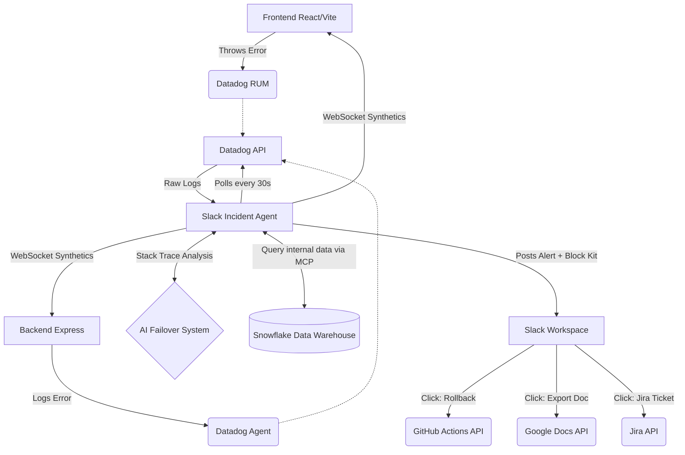

#  Autonomous Slack Incident Agent

A highly resilient, AI-powered Slack bot designed for Hackathons and rapid incident response. It acts as an autonomous Site Reliability Engineer (SRE), constantly monitoring your infrastructure, analyzing errors in real-time, and coordinating the incident response directly in Slack.

##  Core Features

*   ** AI-Powered Incident Summaries **: The moment a new error is detected, the agent analyzes the raw stack traces using 's blazing fast LLMs. It generates a plain-English summary, root cause analysis, and actionable remediation steps right in the Slack thread.
*   ** Autonomous Datadog Integration**: Integrates directly with the Datadog API (including Datadog RUM for frontend). It polls every 30 seconds to catch both backend server crashes and frontend React runtime errors.
*   ** Instant Synthetic Monitoring**: Bypasses the 30-second polling delay using persistent WebSocket connections to both the Express backend and Vite frontend. If a server goes offline completely, the agent is notified instantly.
*   ** Interactive Slack Runbooks**: Rich Slack Block Kit UI with one-click action buttons attached to every incident:
    *   **Deploy Rollback**: Automatically triggers a GitHub Actions rollback workflow.
    *   **Create Jira Ticket**: Instantly creates a Jira issue with the AI's summary.
    *   **Export to Google Docs**: Appends the incident report securely to a centralized Google Doc using Google Service Accounts (`batchUpdate`).
*   ** Conversational AI & Transcript RAG**: Mention `@MCP-Bot` in Slack to chat with it. It reads the recent channel transcript to understand context. It even features a secret backdoor to generate custom messages (like To-Do lists) and automatically DM them to your engineers!
*   ** Automated Paging**: If a `CRITICAL` or `HIGH` severity alert fires, the bot automatically broadcasts to `#announcements` and physically DMs your on-call engineers so they never miss an outage.

##  Architecture



##  Quick Start Guide

### 1. The Slack Bot (The Brain )
This starts the autonomous Datadog polling loop, the Synthetic Monitor WebSockets, and listens to Slack events.
```bash
# From the project root
npm install
npm start
```

### 2. The Backend API (The Server )
Spins up the Express server with endpoints that generate logs and mock crashes.
```bash
cd webapp
npm install
npm start
```
*(Runs on `http://localhost:8080`)*

### 3. The Frontend Website (The UI )
Spins up the React/Vite website equipped with Datadog RUM and "Simulate Outage" buttons.
```bash
cd webapp-frontend
npm install
npm run dev
```
*(Runs on `http://localhost:5173`)*

## 📚 Standard Operating Procedure (SOP)
See the [`runbooks/SOP.md`](runbooks/SOP.md) file for the official GlobalCorp incident protocol regarding triage, auto-rollbacks, and post-mortems.

